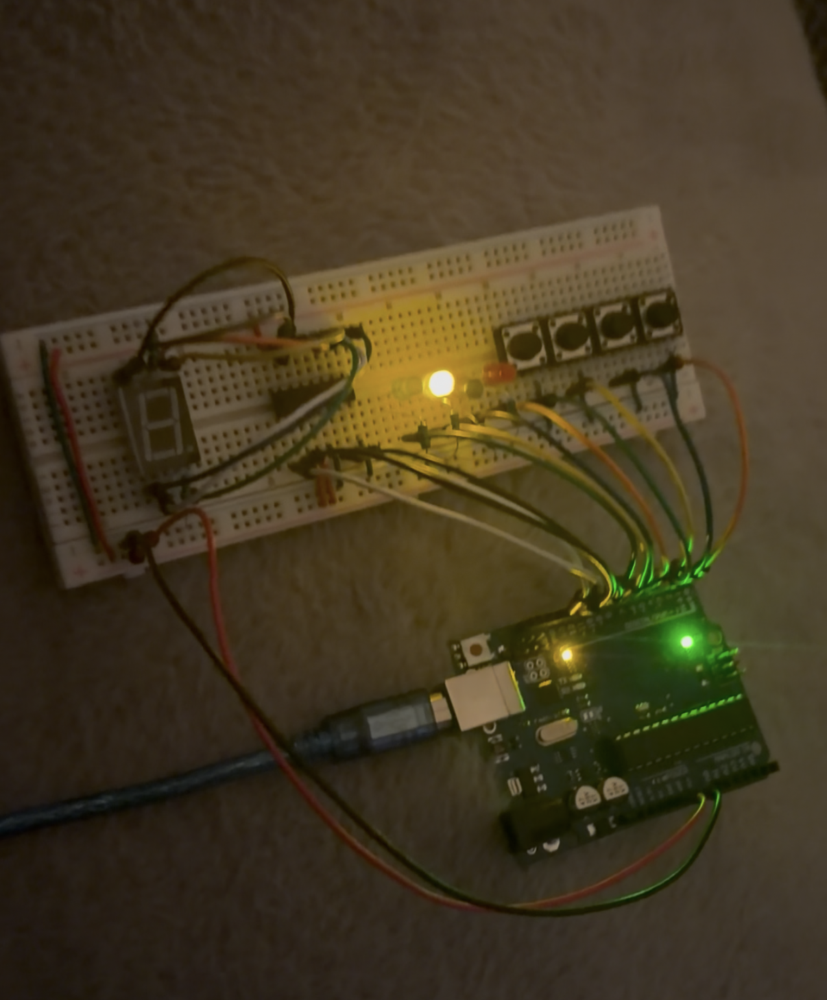

# Color_Memory_Game
This project includes the use of LED, Arduino Uno, and resistors. The game test the player on their memorization skills by flashing the color and then having the player press the corresponding button mimicking the same pattern.

# Code
- [Original Code](Color_Memory_Game.ino)

# Materials Required

| **Part** | **Note** | **Price** | **Link** |
|:--:|:--:|:--:|:--:|
| Arduino Starter Kit | Includes components like Arduino Uno, LED, etc. | $44.88 | <a href="https://www.amazon.com/ELEGOO-Project-Tutorial-Controller-Projects/dp/B01D8KOZF4/ref=sr_1_1?dib=eyJ2IjoiMSJ9._L3JiWgIo_Asrnpq9JBCAvlFJKU-cwUzPEOX6Xf2L2ocJ5VwjOWbJ7InSxeX25zyxpBZeI01sPn8IXm6km2PRBq2fQPugHT_ehDjSpnudGaxnVApmlAN4PU9YooLBBsLg7XqS0qh296_sHdxy7YBotvHfNEnD_3EBUamknDg-kBNTWfYhXJPBygMBY4I29b_IWZBqoqM9pIXMIkWrTluA5y6SZlIzqvk_8UaoxsYUU0.WVJCYuLtjZfC_Pxjs5ltQ35CxXinbD40L-RgbPLhU-w&dib_tag=se&keywords=arduino%2Bstarter%2Bkit&qid=1779928287&sr=8-1&th=1"> Link </a> |
| DMM | Utilized for debugging and circuit analysis | $9.99 | <a href="https://www.amazon.com/dp/B0CXM242J1?ref=fed_asin_title&th=1"> Link </a> |

# Sources
- [Original Project](https://www.instructables.com/Color-Sequence-Memory-Game/)
- [7 Segment Display](https://docs.sunfounder.com/projects/3in1-kit/en/latest/basic_project/ar_dice.html)
