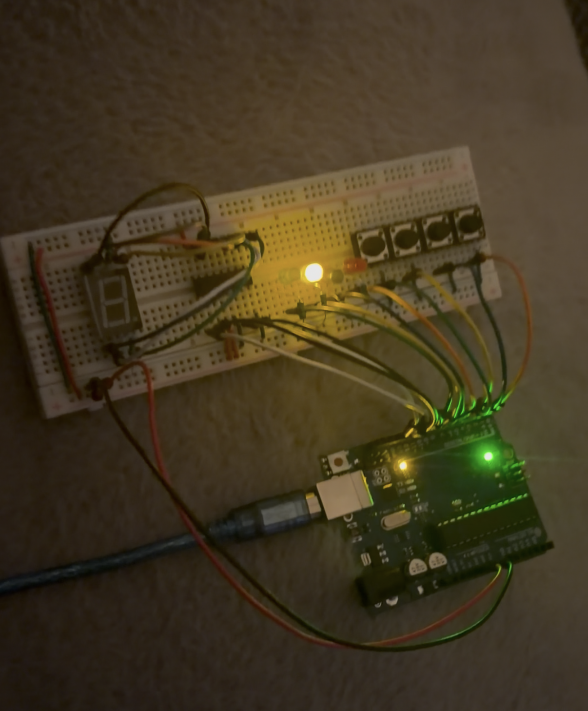
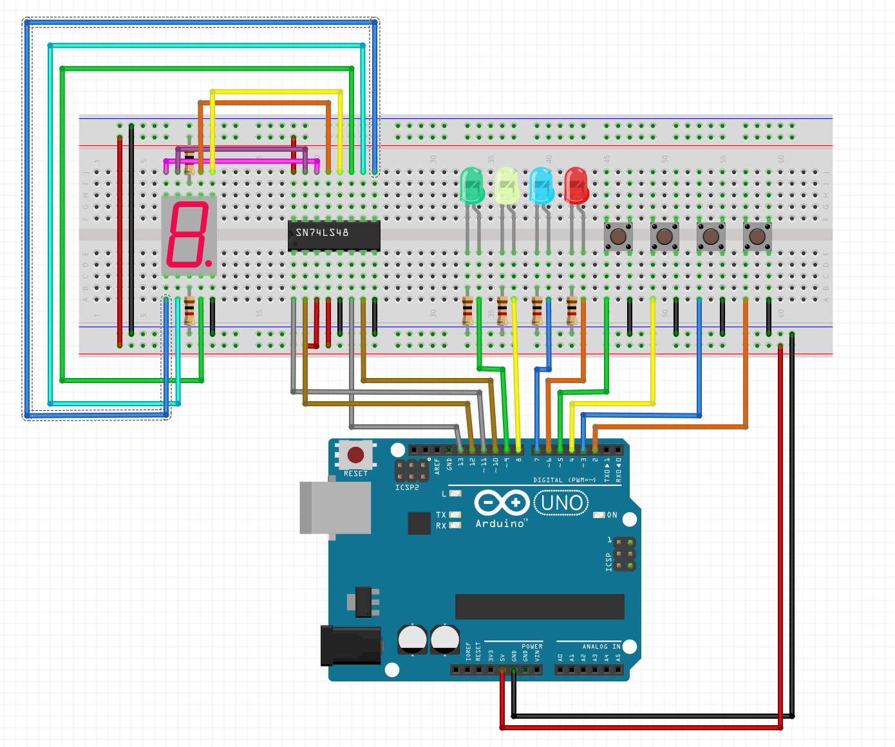

# Color_Memory_Game
This project includes the use of LED, Arduino Uno, and resistors. The game test the player on their memorization skills by flashing the color and then having the player press the corresponding button mimicking the same pattern.

# Code
- [Original Code](Color_Memory_Game.ino)

# Schematics

# Project Notes: Challenges & Fixes
In the completion of this project there were many ups and downs, although overall the project was pretty straight forward. When first wiring up the hardware I ran into issues finding the original decoder utilized in the instructions, so I opted for the 74HC59 included in my 3in1 kit. When wiring up the 74HC59 I found an open source under sun founder kit with the pin layout of the chip. Additionally I had issues with wiring with my buttons, but after finding the pin layout also on sun founder everything was straight forward.

# Materials Required

| **Part** | **Note** | **Price** | **Link** |
|:--:|:--:|:--:|:--:|
| Arduino Starter Kit | Includes components like Arduino Uno, LED, etc. | $44.88 | <a href="https://www.amazon.com/ELEGOO-Project-Tutorial-Controller-Projects/dp/B01D8KOZF4/ref=sr_1_1?dib=eyJ2IjoiMSJ9._L3JiWgIo_Asrnpq9JBCAvlFJKU-cwUzPEOX6Xf2L2ocJ5VwjOWbJ7InSxeX25zyxpBZeI01sPn8IXm6km2PRBq2fQPugHT_ehDjSpnudGaxnVApmlAN4PU9YooLBBsLg7XqS0qh296_sHdxy7YBotvHfNEnD_3EBUamknDg-kBNTWfYhXJPBygMBY4I29b_IWZBqoqM9pIXMIkWrTluA5y6SZlIzqvk_8UaoxsYUU0.WVJCYuLtjZfC_Pxjs5ltQ35CxXinbD40L-RgbPLhU-w&dib_tag=se&keywords=arduino%2Bstarter%2Bkit&qid=1779928287&sr=8-1&th=1"> Link </a> |
| DMM | Utilized for debugging and circuit analysis | $9.99 | <a href="https://www.amazon.com/dp/B0CXM242J1?ref=fed_asin_title&th=1"> Link </a> |

# Sources
- [Original Project](https://www.instructables.com/Color-Sequence-Memory-Game/)
- [7 Segment Display](https://docs.sunfounder.com/projects/3in1-kit/en/latest/basic_project/ar_dice.html)
